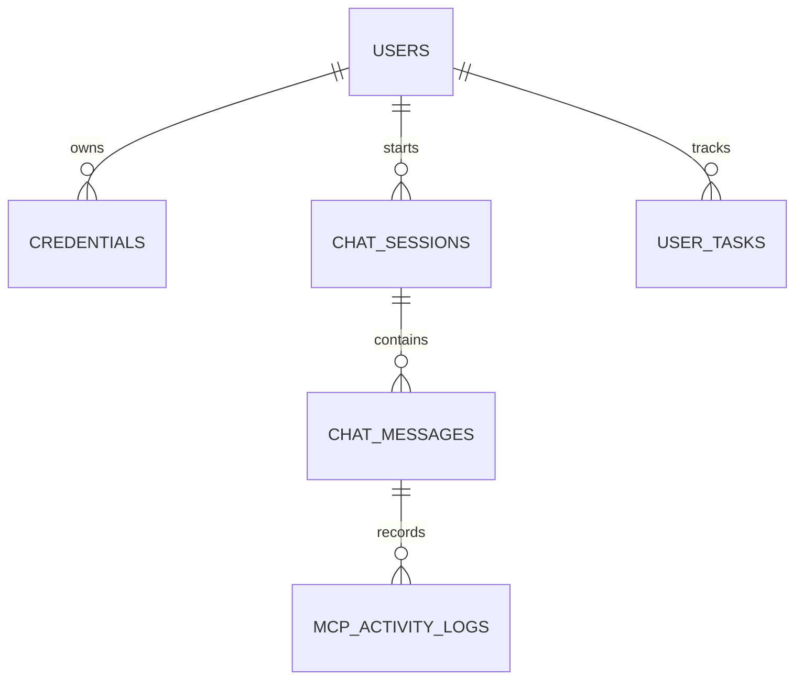

# Database Schema Design - FoundrAI

FoundrAI uses a relational schema optimized for **PostgreSQL**. To guarantee multi-tenant security and prevent unauthorized access, all major entities cascade delete and partition records using a foreign key pointing to the `users` table.

---

## 1. Entity-Relationship Diagram (Mental Model)


---

## 2. Table DDL Definitions (PostgreSQL Dialect)

```sql
-- 1. USERS TABLE
CREATE TABLE users (
    id UUID PRIMARY KEY DEFAULT gen_random_uuid(),
    email VARCHAR(255) UNIQUE NOT NULL,
    hashed_password VARCHAR(255) NOT NULL,
    is_active BOOLEAN DEFAULT TRUE NOT NULL,
    created_at TIMESTAMP WITH TIME ZONE DEFAULT CURRENT_TIMESTAMP NOT NULL,
    updated_at TIMESTAMP WITH TIME ZONE DEFAULT CURRENT_TIMESTAMP NOT NULL
);

-- 2. INTEGRATIONS/CREDENTIALS TABLE (Secure token store)
CREATE TYPE integration_provider AS ENUM ('google', 'github');

CREATE TABLE credentials (
    id UUID PRIMARY KEY DEFAULT gen_random_uuid(),
    user_id UUID NOT NULL REFERENCES users(id) ON DELETE CASCADE,
    provider integration_provider NOT NULL,
    -- Store tokens as encrypted text (Fernet AES-256 string representation)
    encrypted_access_token TEXT NOT NULL,
    encrypted_refresh_token TEXT,
    token_expiry TIMESTAMP WITH TIME ZONE,
    scopes TEXT[] NOT NULL,
    created_at TIMESTAMP WITH TIME ZONE DEFAULT CURRENT_TIMESTAMP NOT NULL,
    updated_at TIMESTAMP WITH TIME ZONE DEFAULT CURRENT_TIMESTAMP NOT NULL,
    -- Ensure a user can only have one integration row per provider
    CONSTRAINT unique_user_provider UNIQUE (user_id, provider)
);

-- 3. CHAT SESSIONS TABLE
CREATE TABLE chat_sessions (
    id UUID PRIMARY KEY DEFAULT gen_random_uuid(),
    user_id UUID NOT NULL REFERENCES users(id) ON DELETE CASCADE,
    title VARCHAR(255) NOT NULL DEFAULT 'New Conversation',
    created_at TIMESTAMP WITH TIME ZONE DEFAULT CURRENT_TIMESTAMP NOT NULL,
    updated_at TIMESTAMP WITH TIME ZONE DEFAULT CURRENT_TIMESTAMP NOT NULL
);

-- 4. CHAT MESSAGES TABLE
CREATE TYPE message_role AS ENUM ('user', 'assistant');

CREATE TABLE chat_messages (
    id UUID PRIMARY KEY DEFAULT gen_random_uuid(),
    session_id UUID NOT NULL REFERENCES chat_sessions(id) ON DELETE CASCADE,
    role message_role NOT NULL,
    content TEXT NOT NULL,
    tokens_used INTEGER DEFAULT 0 NOT NULL,
    created_at TIMESTAMP WITH TIME ZONE DEFAULT CURRENT_TIMESTAMP NOT NULL
);

-- 5. MCP ACTIVITY LOGS TABLE (For showing LLM execution steps in UI)
CREATE TABLE mcp_activity_logs (
    id UUID PRIMARY KEY DEFAULT gen_random_uuid(),
    message_id UUID NOT NULL REFERENCES chat_messages(id) ON DELETE CASCADE,
    mcp_server VARCHAR(100) NOT NULL,      -- 'gmail', 'calendar', 'github'
    tool_name VARCHAR(100) NOT NULL,       -- 'search_emails', 'get_prs'
    tool_input JSONB,                      -- Input arguments sent to the MCP tool
    tool_output_summary TEXT,              -- Short summarized log for display
    created_at TIMESTAMP WITH TIME ZONE DEFAULT CURRENT_TIMESTAMP NOT NULL
);

-- 6. USER TASKS TABLE (For synthesized founder priority checklists)
CREATE TYPE task_priority AS ENUM ('low', 'medium', 'high');
CREATE TYPE task_status AS ENUM ('pending', 'completed');

CREATE TABLE user_tasks (
    id UUID PRIMARY KEY DEFAULT gen_random_uuid(),
    user_id UUID NOT NULL REFERENCES users(id) ON DELETE CASCADE,
    title VARCHAR(255) NOT NULL,
    description TEXT,
    priority task_priority DEFAULT 'medium' NOT NULL,
    status task_status DEFAULT 'pending' NOT NULL,
    source_app VARCHAR(50),                -- 'gmail', 'github', 'calendar', or 'manual'
    source_link TEXT,                      -- Link to the original thread/PR
    due_date TIMESTAMP WITH TIME ZONE,
    created_at TIMESTAMP WITH TIME ZONE DEFAULT CURRENT_TIMESTAMP NOT NULL,
    updated_at TIMESTAMP WITH TIME ZONE DEFAULT CURRENT_TIMESTAMP NOT NULL
);
```

---

## 3. Database Indexing Strategy
To guarantee fast query speeds during API pagination and multi-tenant validations, we establish explicit database indexes:

```sql
-- Speed up credentials checks during MCP adapter initializations
CREATE INDEX idx_credentials_user_provider ON credentials(user_id, provider);

-- Speeds up listing chats in the sidebar
CREATE INDEX idx_chat_sessions_user_created ON chat_sessions(user_id, created_at DESC);

-- Speeds up retrieving chat message histories chronologically
CREATE INDEX idx_chat_messages_session ON chat_messages(session_id, created_at ASC);

-- Speed up fetching activity steps associated with a single AI response stream
CREATE INDEX idx_mcp_activity_logs_message ON mcp_activity_logs(message_id);

-- Speed up fetching active user tasks on dashboard loading
CREATE INDEX idx_user_tasks_user_status ON user_tasks(user_id, status);
```

---

## 4. Key Architectural Decisions for Database
1. **Encrypted Credentials Store**:
   - Access and refresh tokens are stored inside `encrypted_access_token` and `encrypted_refresh_token` using symmetric key cryptography (AES-256-CBC via Python's `cryptography.fernet`).
   - The encryption key is loaded on startup from the `.env` variable `ENCRYPTION_KEY` and is never exposed to database backups.
2. **JSONB Tool Inputs**:
   - Storing MCP tool inputs inside a `JSONB` column allows for flexibility. Different MCP servers (GitHub, Calendar) have varying schemas. JSONB allows logging complex inputs without strict schema updates, and permits indexing inputs if auditing becomes necessary later.
3. **No Mail/Calendar Cache Storage**:
   - There is no table dedicated to caching inbox emails or calendar logs. This aligns with our privacy-first design: retrieve dynamically, synthesize, display, discard.
